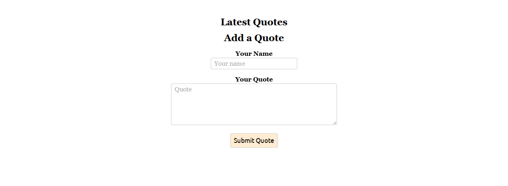
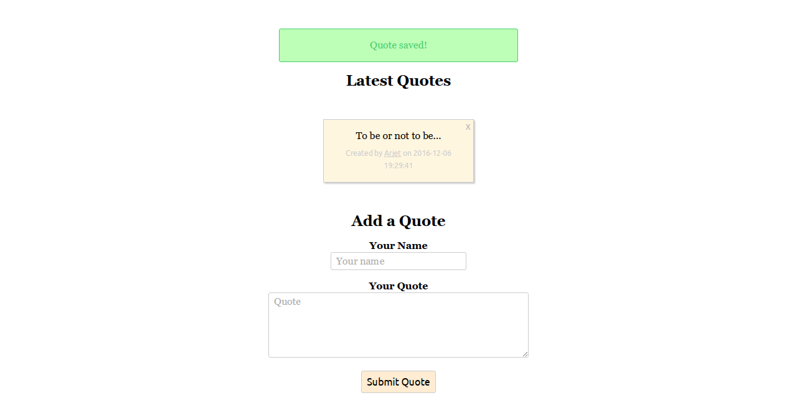
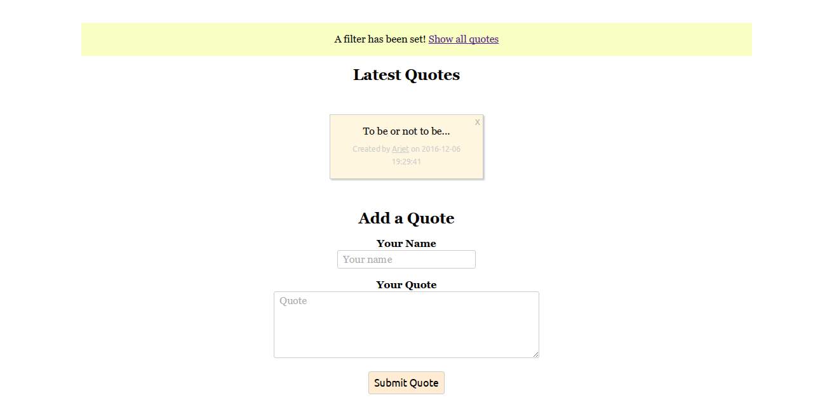

# To do list
A todo application built with laravel using filters for names, flashing, deleting todos and more.

To use this yourself:
  - Modify .env file according to your database
  - Run the commands below

```sh
$ composer dump-autoload
$ composer install
$ php artisan key:generate
$ php artisan migrate
```

Boot the server using vanilla PHP or homestead.


<hr>

<hr>

